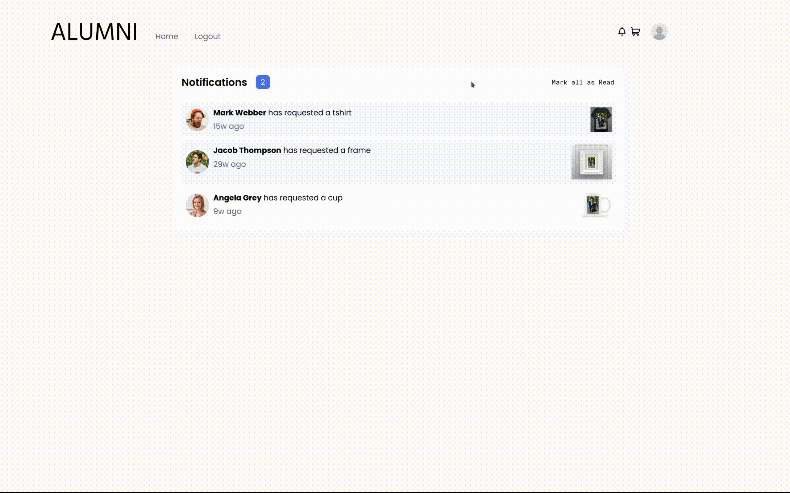

<p align="center"></p>

## Basic Overview

Alumni is a web app that lets users upload, share and organize photos. Users can create and join groups, where they will find other users with common interests.


Users can order photos on different memorabilia, such t-shirts and coffee mugs, or get the photos framed.


When a piece of memorabilia is ordered, a request is sent to one of Alumni's photographers. The photographer can then accept or reject the request.



## Basic Usage

To start the backend enter the following commands:

```bash
cd code/alumni
mvn spring-boot:run
```

To start the frontend enter the following commands:

```bash
cd code/alumni-front
npm install
npm run dev
```
